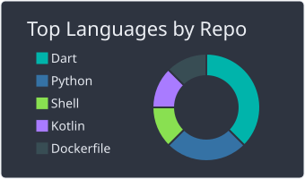
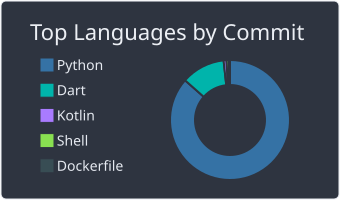
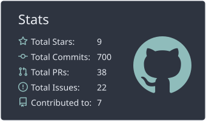
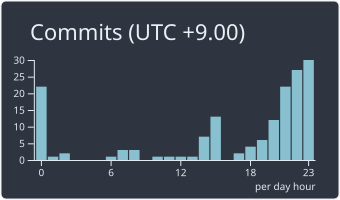

# My Qiita Contributions
  

# My Lapras Potfolio
<!--START_SECTION:lapras-card-->

  
Last Updated on 9/3/2026, 4:02:13 AM

<!--END_SECTION:lapras-card-->

# My Github Profile Trophy
<!-- github-profile-trophy の公開インスタンスが停止しているため、
     .github/workflows/readme-cards.yml で生成したSVGを参照している -->

# My Github Stats
<!-- github-readme-stats の公開インスタンスが停止しているため、
     .github/workflows/readme-cards.yml で生成したSVGを参照している -->

  
  

# My Github Summary Cards
<!-- カードは .github/workflows/readme-cards.yml で生成したSVGを参照している
     先頭は 0-profile-details.svg の代わりに Activity Graph を表示している
     (
内ではmarkdown記法が効かないためタグで埋め込む) -->

  <!-- 実寸1200pxで表示幅いっぱいに広がってしまうため、
       下段カード2枚分の行幅(340 + 隙間23 + 340 ≒ 700)に合わせている -->
  

  
  

  
  

# Skill & Tools
<!-- アイコンはこちらから拝借
 https://icons8.jp/
 一部は https://skillicons.dev (https://github.com/tandpfun/skill-icons) に置き換え
-->

  <!-- Android/iOS系 -->
  
  
  

  <!-- XcodeやAndroid Studio系 -->
  
  

  <!-- OS系 -->
  
  
  
  
  

  <!-- ツール系 -->
  
  
  
  
  
  
  
  
  
  
  
  
  
  
  
  

  <!-- プログラミング言語系 -->
  
  
  
  
  
  
  
  
  
  
  
  
  

  <!-- その他 -->
  
  
  
  
  
  
  

<!--
**Kazuki-0731/Kazuki-0731** is a ✨ _special_ ✨ repository because its `README.md` (this file) appears on your GitHub profile.

Here are some ideas to get you started:

- 🔭 I’m currently working on ...
- 🌱 I’m currently learning ...
- 👯 I’m looking to collaborate on ...
- 🤔 I’m looking for help with ...
- 💬 Ask me about ...
- 📫 How to reach me: ...
- 😄 Pronouns: ...
- ⚡ Fun fact: ...
-->
